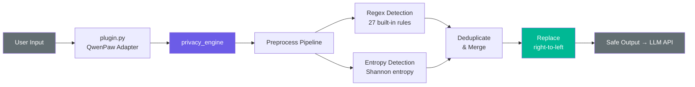

<p align="center">
  
  
  
  
  
</p>

<h1 align="center">LLM Privacy Guard</h1>

<p align="center">
  <b>Your messages. Your machine. Your rules.</b><br>
  <sub>Redact sensitive data <i>before</i> it leaves your computer — not after.</sub>
</p>

<br>

---

## What It Does

Every message you send to ChatGPT, DeepSeek, or Claude passes through the API provider's servers. Paste an IP address, an API key, or a customer's email? It could end up in their logs, training data, or worse.

**LLM Privacy Guard sits between you and the LLM API**, scanning every outgoing message and replacing sensitive data with type-safe placeholders — all locally, before a single byte leaves your machine.

```
┌─────────────────────────────────────────────────────────┐
│  $ You type                                              │
│  ssh root@203.0.113.1 -p 22, key=sk-abc123def4567890    │
│  Customer: zhangjie@company.com, ID: 110101199001011234  │
│                                                          │
│                          ↓  LLM Privacy Guard  ↓         │
│                                                          │
│  $ LLM receives                                          │
│  ssh root@[IP] -p 22, key=[API_KEY]                     │
│  Customer: [EMAIL], ID: [ID_CARD]                        │
└─────────────────────────────────────────────────────────┘
```

The AI never sees your real data. No cloud dependency. No latency. No configuration required.

---

## Features

<table>
<tr>
<td width="50%">

### 🔍 Deep Detection
**27 built-in rules** covering structured and unstructured sensitive data:
- Network identity — IPv4, IPv6 (all formats), hex IPs
- Personal data — emails, phone numbers, ID cards, SSNs
- Secrets — API keys, GitHub tokens, JWTs, SSH keys
- Infrastructure — DB connection strings, CLI commands, credentials
- Financial — credit card numbers with Luhn validation

</td>
<td width="50%">

### 🧠 Entropy Engine
Catches what regex misses — random-looking strings with high Shannon entropy that are **probably keys or tokens**, even without a known format. Auto-replace by default, or switch to review-only mode.

</td>
</tr>
<tr>
<td width="50%">

### 🛡️ Adversarial Defense
Multi-layer preprocessing pipeline defeats common bypass tricks:
- Zero-width character stripping (`u200b`, `u200c`, etc.)
- URL decoding (`%3A` → `:`)
- HTML entity decoding (`&#64;` → `@`)
- Unicode NFKC normalization (fullwidth → halfwidth)

</td>
<td width="50%">

### ⚡ Secure by Default
- ReDoS protection — regex safety validation, IPv6 length guard
- Input cap — 100KB truncation prevents resource exhaustion
- Whitelist — protocol addresses (`0.0.0.0`) never filtered
- No raw values in logs, stats, or persistence

</td>
</tr>
<tr>
<td width="50%">

### 🔌 QwenPaw Native
One-command install. Transparent message interception — you chat normally, privacy guard runs silently. Built-in slash commands for audit and reporting.

</td>
<td width="50%">

### 📦 Framework Agnostic
`privacy_engine/` is pure Python with **zero AI framework dependencies**. Use it standalone, in LangChain callbacks, Dify plugins, or any custom pipeline.

</td>
</tr>
</table>

---

## Quick Start

### QwenPaw Plugin

```bash
qwenpaw plugin install /path/to/llm-privacy-guard
# Done. It intercepts every outgoing message automatically.
```

Verify with `/privacy test`:

```
/privacy test
→ 27 rules active, covering 27 sensitive types
```

### Python Library

```bash
pip install -e /path/to/llm-privacy-guard
```

```python
from privacy_engine import filter_text, scan_text

# Redact
filter_text("ssh root@203.0.113.1, key=sk-abc123")
# → "ssh root@[IP], key=[API_KEY]"

# Audit (no modification)
for m in scan_text("token=ghp_xJ3kL9mN2pQ5rS8"):
    print(f"{m['type']}: {m['value']} → {m['placeholder']}")
```

---

## Detection Rules

| Rule | Target | Placeholder |
|------|--------|-------------|
| `ipv4` · `ipv4_hex` | IPv4 (dotted / hex `0xC0A80101`) | `[IP]` |
| `ipv6` · `ipv6_hyphen` | IPv6 (compressed, bracketed, mixed, hyphen) | `[IP]` |
| `uuid` · `uuid_hex` | UUID (with/without dashes) | `[UUID]` |
| `email` | Email addresses | `[EMAIL]` |
| `phone_cn` · `phone_cn_sep` · `phone_intl` | China mainland + international phones | `[PHONE]` |
| `id_card_cn` · `id_card_cn_sep` | China ID card numbers | `[ID_CARD]` |
| `ssn_us` | US SSN (`XXX-XX-XXXX`) | `[SSN]` |
| `api_key_prefix` | Keys: `sk-`, `pk-`, `Bearer` (case-insensitive) | `[API_KEY]` |
| `aws_access_key` | AWS Access Key (`AKIA...`) | `[AWS_KEY]` |
| `ssh_private_key` · `ssh_public_key` | SSH keys (PKCS#8, RSA, Ed25519, ECDSA) | `[SSH_KEY]` |
| `sha_hash` | 64-char hex hashes (SHA256 etc.) | `[HASH]` |
| `github_token` | GitHub tokens (`ghp_`, `github_pat_`, etc.) | `[GITHUB_TOKEN]` |
| `jwt` · `jwt_multiline` | JWT tokens (standard + newline-separated) | `[JWT]` |
| `db_connection_string` · `db_cli` | DB URLs + CLI commands | `[DB_URL]` · `[DB_CMD]` |
| `credit_card` | Credit card numbers (Luhn validated) | `[CARD]` |
| `credential_value` · `url_query_credential` · `credential_inline` | Inline credentials (assignments, query strings, heredocs, logs) | `[CREDENTIAL]` |

---

## Architecture



| Layer | Responsibility |
|-------|---------------|
| `plugin.py` | QwenPaw glue — intercepts messages, registers `/privacy` commands |
| `detector.py` | Orchestration — regex + entropy, overlap dedup, replacement |
| `patterns.py` | 27 compiled regex rules with priorities |
| `entropy.py` | Sliding-window Shannon entropy with false-positive filters |
| `whitelist.py` | Protocol addresses, RFC domains, hostnames |
| `config.py` | YAML config loader (CWD → plugin → home dir) |

---

## Configuration

```yaml
# config.yaml (optional — defaults work out of the box)
entropy:
  enabled: true
  threshold: 5.0          # higher = stricter
  mode: "auto"            # "auto" | "review"

rules:
  email: false            # disable rules you don't need

custom_rules:
  - name: "internal_srv"
    pattern: "srv-\\d{4}\\.internal\\.com"
    placeholder: "[INTERNAL]"

whitelist:
  ips: ["8.8.8.8"]       # never redact these
  strings: ["public-value-123"]
```

---

## Slash Commands (QwenPaw)

| Command | Description |
|---------|-------------|
| `/privacy test` | Verify plugin is active and rules are loaded |
| `/privacy scan` | Scan the current conversation for sensitive data |
| `/privacy report` | Session + cumulative statistics |
| `/privacy export` | Export aggregated report as JSON |
| `/privacy reset` | Reset session stats (archived to cumulative) |

---

## Roadmap

- [x] QwenPaw plugin with transparent interception
- [x] `/privacy scan`, `report`, `export`, `reset` commands
- [x] 27 detection rules + entropy engine
- [x] Adversarial bypass defense (preprocess pipeline)
- [x] Security hardening (ReDoS, input cap, rate canary)
- [ ] **VSCode extension** — side-loadable `.vsix` for Trae / Cursor / Windsurf / VS Code, with local proxy for transparent message filtering
- [ ] Dify plugin adapter
- [ ] LangChain callback adapter
- [ ] Built-in small LLM for semantic filtering

---

## License

Apache 2.0 © 2026 [lenychang](https://github.com/lenychang520)
