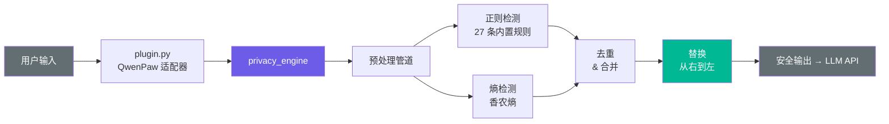

<p align="center">
  
  
  
  
  
</p>

<h1 align="center">LLM Privacy Guard</h1>

<p align="center">
  <b>你的消息。你的机器。你的规则。</b><br>
  <sub>在敏感数据离开电脑<b>之前</b>就脱敏 —— 而不是事后补救。</sub>
</p>

<br>

---

## 它做什么

你发给 ChatGPT、DeepSeek、Claude 的每一条消息，都会经过 API 服务商的服务器。不小心粘贴了 IP 地址、API Key 或客户邮箱？这些数据可能留在对方的日志、训练数据里——甚至更糟。

**LLM Privacy Guard 位于你和 LLM API 之间**，扫描每条发出的消息，用类型占位符替换敏感数据——全程本地执行，一个字节都不会未经处理就离开你的机器。

```
┌──────────────────────────────────────────────────────────┐
│  $ 你输入                                                 │
│  ssh root@203.0.113.1 -p 22, key=sk-abc123def4567890    │
│  Customer: zhangjie@company.com, ID: 110101199001011234  │
│                                                           │
│                         ↓  LLM Privacy Guard  ↓          │
│                                                           │
│  $ LLM 收到                                               │
│  ssh root@[IP] -p 22, key=[API_KEY]                     │
│  Customer: [EMAIL], ID: [ID_CARD]                        │
└──────────────────────────────────────────────────────────┘
```

AI 永远看不到你的真实数据。零云依赖、零延迟、零配置。

---

## 特性

<table>
<tr>
<td width="50%">

### 🔍 深度检测
**27 条内置规则**覆盖结构化与非结构化敏感数据：
- 网络身份 — IPv4、IPv6（所有格式）、十六进制 IP
- 个人信息 — 邮箱、手机号、身份证、SSN
- 机密凭证 — API Key、GitHub Token、JWT、SSH Key
- 基础设施 — 数据库连接串、CLI 命令、凭证赋值
- 金融数据 — 信用卡号（含 Luhn 校验）

</td>
<td width="50%">

### 🧠 熵引擎
捕捉正则漏掉的东西——无固定格式但字符分布异常均匀的高熵字符串，大概率是密钥或 token。默认自动替换，也可切换为仅标记模式。

</td>
</tr>
<tr>
<td width="50%">

### 🛡️ 对抗防御
多层预处理管道击破常见绕过技巧：
- 零宽字符剥离（`u200b`、`u200c` 等）
- URL 解码（`%3A` → `:`）
- HTML 实体解码（`&#64;` → `@`）
- Unicode NFKC 规范化（全角 → 半角）

</td>
<td width="50%">

### ⚡ 默认安全
- ReDoS 防护 — 正则安全校验、IPv6 长度守卫
- 输入截断 — 超 100KB 自动截断防资源耗尽
- 白名单 — 协议地址（`0.0.0.0`）永不过滤
- 日志、统计、持久化中不存任何原始值

</td>
</tr>
<tr>
<td width="50%">

### 🔌 QwenPaw 原生
一行命令安装。透明拦截消息——正常聊天，隐私卫士静默运行。内置斜杠命令用于审计和报告。

</td>
<td width="50%">

### 📦 框架无关
`privacy_engine/` 纯 Python，**零 AI 框架依赖**。可独立使用，也可接入 LangChain callback、Dify 插件或任何自定义管道。

</td>
</tr>
</table>

---

## 快速开始

### QwenPaw 插件

```bash
qwenpaw plugin install /path/to/llm-privacy-guard
# 完成。自动拦截每条发出的消息。
```

用 `/privacy test` 验证：

```
/privacy test
→ 当前 27 条规则运行中，覆盖 27 种敏感类型
```

### Python 库

```bash
pip install -e /path/to/llm-privacy-guard
```

```python
from privacy_engine import filter_text, scan_text

# 脱敏
filter_text("ssh root@203.0.113.1, key=sk-abc123")
# → "ssh root@[IP], key=[API_KEY]"

# 审计（不修改原文）
for m in scan_text("token=ghp_xJ3kL9mN2pQ5rS8"):
    print(f"{m['type']}: {m['value']} → {m['placeholder']}")
```

---

## 检测规则

| 规则 | 目标 | 占位符 |
|------|------|--------|
| `ipv4` · `ipv4_hex` | IPv4（点分 / 十六进制 `0xC0A80101`） | `[IP]` |
| `ipv6` · `ipv6_hyphen` | IPv6（压缩、方括号、混合、连字符） | `[IP]` |
| `uuid` · `uuid_hex` | UUID（带/不带横杠） | `[UUID]` |
| `email` | 邮箱地址 | `[EMAIL]` |
| `phone_cn` · `phone_cn_sep` · `phone_intl` | 中国大陆 + 国际手机号 | `[PHONE]` |
| `id_card_cn` · `id_card_cn_sep` | 中国身份证号 | `[ID_CARD]` |
| `ssn_us` | 美国 SSN（`XXX-XX-XXXX`） | `[SSN]` |
| `api_key_prefix` | 密钥：`sk-`、`pk-`、`Bearer`（大小写不敏感） | `[API_KEY]` |
| `aws_access_key` | AWS Access Key（`AKIA...`） | `[AWS_KEY]` |
| `ssh_private_key` · `ssh_public_key` | SSH 密钥（PKCS#8、RSA、Ed25519、ECDSA） | `[SSH_KEY]` |
| `sha_hash` | 64 位十六进制哈希（SHA256 等） | `[HASH]` |
| `github_token` | GitHub Token（`ghp_`、`github_pat_` 等） | `[GITHUB_TOKEN]` |
| `jwt` · `jwt_multiline` | JWT Token（标准 + 换行分隔变体） | `[JWT]` |
| `db_connection_string` · `db_cli` | 数据库 URL + CLI 命令 | `[DB_URL]` · `[DB_CMD]` |
| `credit_card` | 信用卡号（Luhn 校验） | `[CARD]` |
| `credential_value` · `url_query_credential` · `credential_inline` | 行内凭证（赋值、query string、heredoc、日志） | `[CREDENTIAL]` |

---

## 架构



| 层 | 职责 |
|----|------|
| `plugin.py` | QwenPaw 粘合层 — 拦截消息、注册 `/privacy` 命令 |
| `detector.py` | 编排层 — 正则 + 熵、重叠去重、替换 |
| `patterns.py` | 27 条编译后的正则规则（含优先级） |
| `entropy.py` | 滑动窗口香农熵 + 误报过滤器 |
| `whitelist.py` | 协议地址、RFC 域名、主机名 |
| `config.py` | YAML 配置加载器（CWD → 插件目录 → 用户目录） |

---

## 配置

```yaml
# config.yaml（可选 — 默认配置开箱即用）
entropy:
  enabled: true
  threshold: 5.0          # 越高越严格
  mode: "auto"            # "auto" | "review"

rules:
  email: false            # 关闭不需要的规则

custom_rules:
  - name: "internal_srv"
    pattern: "srv-\\d{4}\\.internal\\.com"
    placeholder: "[INTERNAL]"

whitelist:
  ips: ["8.8.8.8"]       # 永不脱敏
  strings: ["public-value-123"]
```

---

## 斜杠命令（QwenPaw）

| 命令 | 说明 |
|------|------|
| `/privacy test` | 验证插件激活状态与规则加载 |
| `/privacy scan` | 扫描当前对话中的敏感数据 |
| `/privacy report` | 会话 + 累计统计报告 |
| `/privacy export` | 导出聚合报告为 JSON |
| `/privacy reset` | 重置会话统计（归档到累计） |

---

## 路线图

- [x] QwenPaw 插件（透明拦截）
- [x] `/privacy scan`、`report`、`export`、`reset` 命令
- [x] 27 条检测规则 + 熵引擎
- [x] 对抗绕过防御（预处理管道）
- [x] 安全加固（ReDoS、输入截断、速率金丝雀）
- [ ] **VSCode 扩展** — 可侧载的 `.vsix` 插件，覆盖 Trae / Cursor / Windsurf / VS Code，内置本地代理实现透明消息过滤
- [ ] Dify 插件适配
- [ ] LangChain callback 适配
- [ ] 内置小型 LLM 语义过滤

---

## 许可

Apache 2.0 © 2026 [lenychang](https://github.com/lenychang520)
